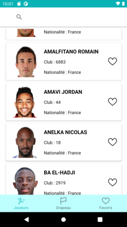
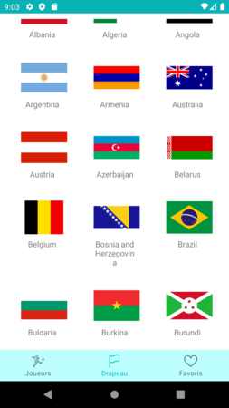
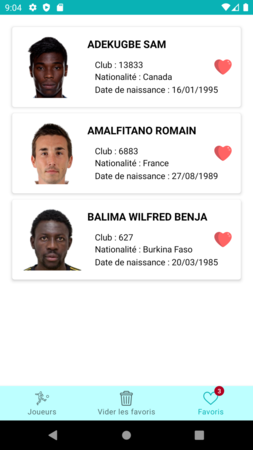
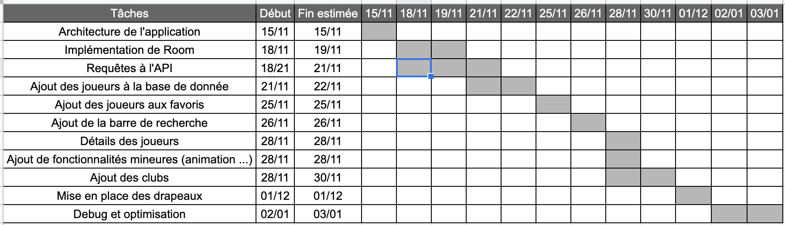
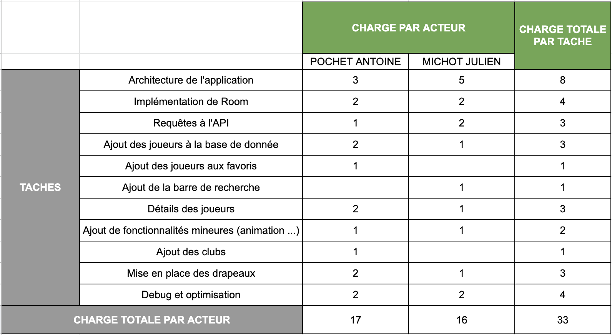

# ⚽ FootBoard ⚽

Voici le dépôt du Projet final de TAC.

Notre application Android permet de decouvrir des joueurs de football triés par de nombreux pays et de les garder en favoris. Elle implémente une architecture MVVM et le pattern repository.
On utilise retrofit pour requeter l'API et room DB pour les données en local.

## API utilisée :
[SportMonks](https://docs.sportmonks.com/football/)

## Librairies utilisées :
- [Retrofit2](https://square.github.io/retrofit/)
- [Room](https://developer.android.com/training/data-storage/room)
- [Picasso](https://square.github.io/picasso/)
---
## Quelques captures :

---
## Tableau de planification :

## Tableau de répartition des tâches :

